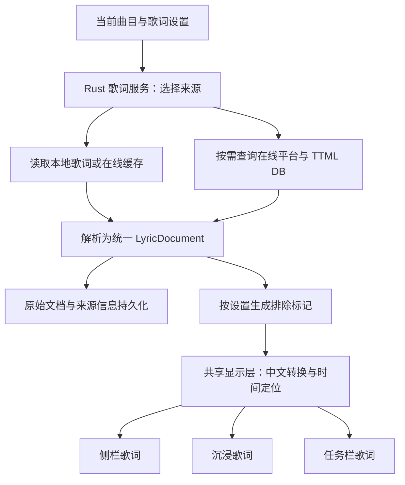

**歌词设置与 TTML 接入规划**

日期：2026-09-17。目标：将截图中 SPlayer 的五项“歌词内容”功能接入当前 Seraph Audio Player。本文是实现建议，尚未修改产品代码。

推荐顺序：统一歌词数据与设置 → 源优先级、繁体转换、排除规则 → 本地 TTML 与逐字显示 → 在线 TTML 与数据库地址配置。

**1. 当前项目已经具备的基础**

| 能力 | 当前实现 | 对本次开发的影响 |
| --- | --- | --- |
| 本地歌词 | `src-tauri/src/ipc/library/lyrics.rs` 支持 LRC、QRC、KRC、YRC；`media_library.rs` 优先读取同名外部歌词，否则使用内嵌歌词 | 复用导入和解密能力，增加 TTML 入口 |
| 在线匹配 | `src-tauri/src/ipc/library/online_lyrics.rs` 并发搜索网易云、酷狗、QQ；已有候选去重、超时和失败区分 | 在现有三源上增加策略层，保留并发能力 |
| 手动选词 | `src/store/player/lyricsActions.ts` 提供导入、搜索、应用；侧栏和沉浸模式共用搜索流程 | 扩展候选和保存接口，让来源身份随歌词一起保存 |
| 歌词模型 | TypeScript 与 Rust 的 `LyricLine` 均只有 `time`、`text` | 无法保存逐词起止时间、明确的译文/音译关系与重叠人声，是 TTML 的主要前置工作 |
| 歌词展示 | 侧栏、沉浸模式、任务栏；相同时间的行被归为一组 | 共享新模型和显示转换，避免三个入口各自处理 |
| 动画 | `TypewriterText.tsx` 按固定节奏逐字出现 | TTML 需要按真实播放时间驱动单词高亮；现有动画可继续用于普通行级歌词 |
| 设置与存储 | Zustand 持久化、配置导入导出；Rust 曲库按元数据/歌词分文件进行快照提交 | 增加歌词设置和数据版本迁移，延续按需读取歌词的机制 |

另一个关键点：当前 `Track.sourceId` 主要用于 Bilibili BV 号，没有独立的音乐平台歌曲身份映射。不能把本地 `track.id` 或 BV 号直接作为 AMLL 查询 ID。

**2. 五项设置的建议行为**

以下是适合 Seraph 的默认策略，不代表已经核实 SPlayer 的内部实现。

| 截图功能 | 建议交互与默认值 | 生效时机 |
| --- | --- | --- |
| 歌词源优先级 | 自动 / 网易云优先 / QQ 优先 / 酷狗优先；默认自动。优先项无合适结果时允许回退 | 下一次获取；提供“重新匹配当前歌曲”入口 |
| 更喜欢繁体中文 | 默认关闭；开启后对中文原文和中文译文做显示转换 | 当前歌词立即更新，不重新下载 |
| 启用在线 TTML 歌词 | 首版保留 Beta 标识，默认关闭；开启后允许自动匹配和查询 TTML | 下一首歌；可主动重新匹配当前歌曲 |
| AMLL TTML DB 地址 | 预设镜像、自定义地址模板、测试连接、恢复默认；保存前校验 | 下一次请求；保存地址本身不替换当前歌词 |
| 歌词排除配置 | 关键词 / 正则两种规则，可启停、删除；显示受影响歌词预览。默认规则列表为空 | 保存后立即更新所有歌词视图 |

新增“歌词设置”标签，放在现有 `SettingsModal.tsx` 中。先沿用 Seraph 现有视觉风格与表单组件，五项功能可独立完成，不依赖设置弹窗整体改版。

**3. 共用处理链路**



Rust 负责网络、缓存、解析、来源策略与规则校验；前端负责显示转换、滚动与动画。下载、解析、规则处理均在音频实时回调之外执行。设置变更只更新显示投影，转换、过滤后的文本不写回原始音频或覆盖原始歌词。

**4. 先升级歌词模型**

建议新增 `LyricDocument`，时间统一使用毫秒整数。现有播放器的秒单位只在桥接处转换。以下是模型要点，实际 Rust/TypeScript 定义需要保持一致：

```ts
interface LyricDocument {
  schemaVersion: 2;
  revision: string;
  format: "lrc" | "qrc" | "krc" | "yrc" | "ttml" | "text";
  sync: "none" | "line" | "word";
  source: {
    kind: "legacy" | "imported" | "sidecar" | "embedded" | "online";
    provider?: "netease" | "qq" | "kugou" | "amll";
    providerTrackId?: string;
  };
  cues: LyricCue[];
}

interface LyricCue {
  id: string;
  startMs?: number; // 无同步信息时不填写
  endMs?: number;
  text: string;
  language?: string;
  words?: Array<{ text: string; startMs: number; endMs: number }>;
  translations?: Array<{ language?: string; text: string }>;
  romanization?: string;
  speakerId?: string;
  isBackground?: boolean;
}
```

歌曲与平台 ID 的关联、自动/手动选择状态单独保存为 `LyricBinding`。`providerTrackId` 不能由中文来源标签或候选 ID 字符串临时拆出来代替结构化字段；AMLL 条目还应保存其具体关联的平台和歌曲 ID。

模型迁移时需要处理：

- 新解析器直接保留译文、音译与原文的关系。旧数据可按现有同时间分组方式兼容展示，但不能把任意同时出现的两句都断言为原文/译文。
- QRC/KRC/YRC 当前会压平成行级文本。新解析结果应保留已有逐词时间，避免只让 TTML 获得新能力。旧缓存已经丢失的逐词时间只能通过重新解析原文件或重新获取恢复。
- LRC 缺少结束时间时，可以用下一组的开始时间确定展示区间，标记为推导值；不能平均分配字符时间来冒充逐字同步。
- 新导入纯文本明确标为 `sync: none`。现有纯文本解析会每行分配四秒，迁移时无法可靠识别哪些旧时间是合成值，应保留旧显示兼容性。
- TTML 可能存在重叠句和背景人声；时间定位需要支持多个活动区间，滚动单独选择一个主句。不能完全沿用“二分找到最后一个开始时间”的单活动行假设。

**5. 歌词源优先级与手动选择**

建议把“平台偏好”和“歌词格式”分开处理：网易云/QQ/酷狗是来源，TTML/LRC 是格式。缓存是取数方式，不是一种更高优先级的歌词源。

自动选择按以下规则执行：

1. 用户手动导入或明确应用的歌词视为固定选择，后续自动请求不能替换。提供“恢复自动匹配”操作。
2. 自动模式先立即展示现有可用歌词；启用在线 TTML 后，在身份和版本匹配可靠时再原子切换到 TTML。
3. TTML 未收录、格式不支持、解析失败或网络失败，继续使用原有歌词。没有原有歌词时，使用现有三源匹配流程获取候选。
4. 普通歌词的默认回退顺序为同名外部歌词 → 内嵌歌词 → 在线同步歌词 → 纯文本。已有可用歌词无需每次播放重复三源查询。
5. “自动”先比较标题、歌手、版本和时长等匹配程度，再比较同步能力、译文等质量；指定平台优先时，也只在匹配合格的候选中提高该平台优先级。

保留现有三源并发搜索，设置优先级体现在候选排序和选择，不改成三次串行等待。扩展 `fetch_online_lyrics` 的输入/候选结果，并让 `apply_online_lyrics` 接受候选身份与文档，避免应用后只剩一份没有来源的文本。

老曲库无法区分“手动选过”与“自动导入”时，先把已有歌词作为保留选择；用户主动重新匹配后再进入新策略。

**6. TTML：先本地验证，再连接数据库**

先让手动导入和同名歌词发现支持 `.ttml`，用真实样例验证 `begin`/`end`、时间单位与继承规则、命名空间、逐词 span、译文、音译和背景人声。解析器建议置于 Rust 歌词模块，使用 XML 解析库处理 AMLL 所用的 TTML 子集；不承诺首版支持整个 TTML 标准，也不使用正则解析 XML。

TTML 高亮以 Rust 播放位置为锚点，前端在可见时用 `requestAnimationFrame` 插值；暂停、跳转、切歌和重新显示窗口时重新对齐。只更新活动句/词的显示，不让整篇歌词随每帧重渲染。普通歌词继续保留现有行级跟随与打字机效果。

在线接入需要增加本地曲目与数据库条目的关联：

- 优先复用用户已经确认的音乐平台 ID；否则用标题、歌手、专辑、时长搜索候选。
- 保留 Live、Remaster、翻唱等版本信息参与匹配；不能为提高命中率把版本标记全部删除。
- 高置信度结果才允许自动绑定；模糊结果复用现有候选预览，让用户选定，并保存关联以便下次直接查询。
- 如果数据库提供可用的元数据索引，可增加索引适配器；是否存在、字段和更新方式需要核对上游文档，不能预设它是按歌名搜索的 REST API。
- 数据库没有收录不等于歌曲没有歌词。界面保留现有普通歌词，只在用户主动操作时说明 TTML 的匹配结果。

数据库地址配置建议使用“预设 + 高级模板”，模板支持哪些平台、路径与占位符由适配器明确规定。正式默认地址和模板必须在核对上游规范后填写。测试连接需要区分地址不可达、目标未收录、返回 HTML、无效 XML 和不支持的 TTML 内容。

沿用 `url_guard.rs` / `http_util.rs` 的网络校验和响应大小限制。自定义模板需限制为 HTTPS、拒绝凭据和本地/内网目标，固定允许的占位符，编码歌曲 ID，并逐跳校验重定向；不能为支持镜像而取消现有 URL 校验。

**7. 繁体转换与排除规则**

繁体转换建议采用 `opencc-js` 的通用简转繁词组转换，按需加载字典，放在共享纯函数/Worker 模块中，三个歌词视图共用同一逻辑。实施时核对库版本与打包大小。

- 优先依据语言标记处理中文原文与中文译文；缺少标记时保守判断，避免改变日文汉字和音译内容。
- 保留原始文本，关闭开关即可恢复；不额外发起翻译请求，也不生成原歌词没有的译文或音译。
- 逐字歌词要检查整句转换结果与词段的映射。无法可靠保持对应关系时，该句显示转换后的文本并降级为行级高亮，保留真实行时间，避免错配字符时间。
- 显示结果按“文档版本 + 转换模式”缓存；播放进度变化不重复执行转换。

排除规则建议由 Rust 现有 `regex` 库编译执行，关键词使用字面包含匹配。首版限定规则数量和长度，例如最多 50 条、每条 256 字符；编译只在规则修改时执行，不在每帧或每次定位时执行。

- 规则匹配转换前的原始可读文本，编辑界面明确这个口径，并展示命中预览。
- 默认匹配原文、译文或音译，任一命中时隐藏整组，避免留下孤立的翻译。后续可增加仅隐藏译文等高级选项。
- 使用 `hiddenCueIds` 等显示标记，保留原始时间区间。被隐藏句播放期间不应延长上一句，也不改变后续点击定位时间。
- 无效正则不能保存并替换现行有效配置。提示 Rust 正则不支持的语法，例如反向引用和环视。
- 可提供“制作信息”可选预设，使用行首与冒号约束，例如 `^(作词|作曲|编曲)\s*[:：]`；默认不启用大范围关键词过滤。
- 全部被过滤时显示“歌词已被排除规则隐藏”，与“没有歌词”区分，并提供关闭规则的入口。

**8. 设置、缓存和多窗口一致性**

新增主窗口专用 `lyricsSettings` store，保存来源偏好、繁体开关、在线 TTML 开关、数据库配置和排除规则；继续使用版本化校验，纳入 `configTransfer.ts` 的配置备份与启动导入流程，并补充界面自救重置。

Rust 接收带递增版本的设置快照，作为网络与过滤决策依据。主窗口是设置的唯一持久化写入者；任务栏窗口通过只读 IPC 快照和变更事件获得所需数据，不导入 Zustand 持久化 store。新增任务栏 IPC 时同步更新 `lib.rs` 的窗口命令白名单及其回归检查。

在线缓存建议保存原始内容与解析版本，键包含数据库配置身份、平台、歌曲 ID、格式和解析器版本。转换/过滤结果只作内存投影。优先命中有效缓存，支持到期复验；“未收录”使用短期负缓存，网络失败不作为长期未收录记录。已选定歌词与可清理的下载缓存分开，清缓存不丢用户手动选择。

异步结果需要携带 `trackId`、请求序号、歌词版本与设置版本：快速切歌、切回同一曲目、修改镜像、手动应用新歌词，都应让旧请求失去发布资格。写入选定歌词时也在后端核对版本，不能只在 UI 层丢弃迟到结果。相同请求合并，主窗口与任务栏不能重复触发下载。

内容变更沿用并扩展 `seraph://track-lyrics-updated`；设置变更增加单独通知，使繁体和排除规则无需切歌即可同步。任务栏新建时先获得快照，再按版本接受事件，避免旧快照覆盖新设置。

曲库歌词从 `Vec<LyricLine>` 迁移到新文档时，需要升级存储清单版本，兼容读取旧格式，并保留完整旧代次/迁移备份。迁移成功后再切换清单；仍按需读取当前曲目歌词，不把丰富文档塞回全库列表或播放队列同步载荷。

**9. 建议代码落点**

| 位置 | 工作内容 |
| --- | --- |
| 新增 `src/types/lyrics.ts`；扩展 Rust 歌词类型 | 统一文档、候选来源、平台关联、版本和显示投影类型 |
| 新增 `src-tauri/src/lyrics/` | 集中管理来源策略、TTML 解析、规则编译与缓存；通过现有 library IPC 接入 |
| `src-tauri/src/ipc/library/online_lyrics.rs` | 保留三源提供者，补充结构化平台 ID、候选评分和来源偏好 |
| `src-tauri/src/ipc/library/lyrics.rs`、`media_library.rs` | 保留原格式解析能力，升级逐词信息，并增加 TTML 文件识别 |
| `src-tauri/src/ipc/library/commands.rs`、`storage.rs` | 新文档读写、原子迁移、选定歌词版本校验和更新通知 |
| 新增 `src/store/lyricsSettings.ts` 与歌词设置组件 | 五项设置、配置弹窗、即时预览和设置快照同步 |
| `src/store/player/lyricsActions.ts`、`src/hooks/usePlayback.ts` | 复用搜索应用流程，按曲目读取新文档、合并请求并防止迟到覆盖 |
| `src/lib/lyrics/` 与共享逐字行组件 | 时间区间定位、繁体显示投影、普通歌词兼容和 TTML 高亮 |
| `LyricsPanel.tsx`、`ImmersiveLyrics.tsx`、`TaskbarLyricsBar.tsx` | 统一消费文档与显示设置，保留各自布局和播控交互 |
| `configTransfer.ts`、启动导入/重置、`lib.rs` | 设置迁移备份、恢复流程与任务栏只读权限 |

**10. 分阶段交付与验收**

| 阶段 | 可交付结果 | 验收重点 |
| --- | --- | --- |
| A：数据与设置底座 | 新模型、旧格式适配、设置持久化和多窗口快照 | 老曲库升级后仍能读歌词；重启与配置导入有效；丰富歌词不进入全库队列同步 |
| B：基础三项 | 源优先级、繁体显示、关键词/正则过滤 | 源偏好可观察且失败能回退；关闭转换/规则可恢复；三个显示入口一致 |
| C：本地 TTML | 导入、解析、真实逐字同步、已有译文和音译展示 | 本地文件可独立验证；暂停、seek、前奏、间奏、重叠人声和未知时长行为正确 |
| D：在线 TTML | 平台关联、DB 地址配置、缓存与自动回退 | 命中、未收录、超时、无效内容都可解释；旧请求不覆盖新歌或手动选择 |
| E：集成验证 | 完整设置页与回归覆盖 | 快速切歌、多窗口开关、重启、存储失败恢复、长歌词与性能均通过 |

优先做有代表性的解析与流程测试：普通 LRC、双语同时间歌词、已有 QRC/KRC/YRC、纯文本、带逐词/译文/音译的 TTML、重叠句和畸形输入。TTML 新路径沿用既有文件/行数限制，并补上总词段数、嵌套深度与时间范围限制。

重点复用当前 `LyricsPanel.test.tsx`、`ImmersiveLyrics.test.tsx`、`TaskbarLyricsBar.test.tsx`、`usePlayback.test.ts`、配置迁移与 Rust 存储恢复测试。实现后运行受影响测试、类型检查、构建和对应 Rust 检查，并在真实 Tauri 窗口验收逐字同步与任务栏行为。本文仅做代码静态梳理，没有执行运行时验证。

主要工作量集中在歌词模型迁移、逐词同步和本地曲目身份匹配；设置页面、关键词规则和来源排序相对简单。建议以“本地 TTML 可正确播放”为中间里程碑，再接网络功能。

**待核对的上游信息**

SPlayer v3.1.1 的实际选项语义、AMLL TTML DB 的可用平台/索引/默认地址、TTML 扩展格式与相关依赖版本，仍需实施前核对。此次匿名访问公开 GitHub 文档先被网络沙箱阻止，随后自动审批服务返回 403 权限错误，未能完成审核；未将未经核对的地址或接口写成已确认事实。
